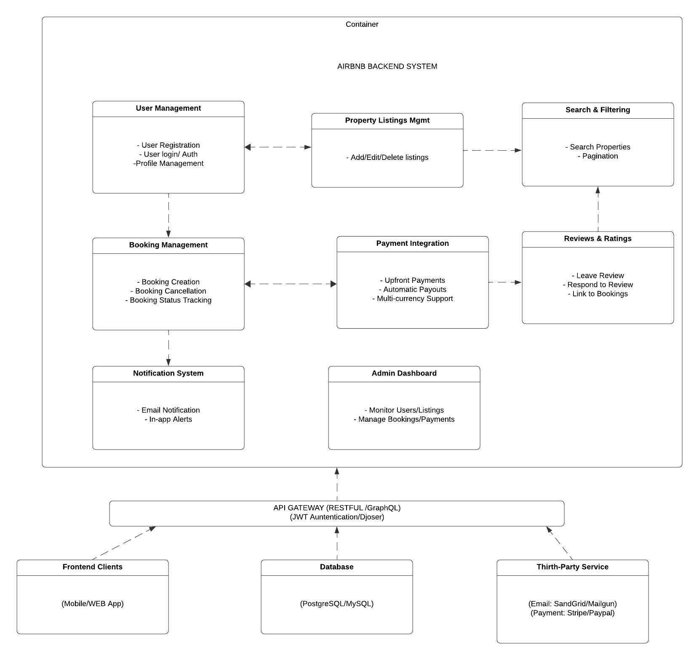

# 🏠 Airbnb Clone Backend: Features and Functionalities

This document outlines the essential features and functionalities required for the backend of the Airbnb Clone project, based on the official project requirements. These specifications are critical for building a scalable, secure, and robust system that supports the overall goals of the application.

---

## 🔑 Core Functionalities

The backend must support the following key features to enable the core operations of a rental marketplace:

### 👥 User Management
- **User Registration**: Allow users to register as guests or hosts using secure authentication (JWT).
- **User Login and Authentication**: Support login via email/password and social login (OAuth: Google, Facebook).
- **Profile Management**: Enable users to update their profiles, including profile pictures, contact info, and preferences.

### 🏘️ Property Listings Management
- **Add Listings**: Hosts can create listings by entering title, description, location, price, amenities, and availability.
- **Edit/Delete Listings**: Hosts can modify or delete their own property listings.

### 🔍 Search and Filtering
- Implement robust search functionality by:
  - Location
  - Price range
  - Guest capacity
  - Amenities (e.g., Wi-Fi, pool, pet-friendly)
- Enable **pagination** for handling large datasets.

### 📅 Booking Management
- **Booking Creation**: Guests can book a property for specific dates. The system must validate dates to prevent double bookings.
- **Booking Cancellation**: Guests and hosts can cancel bookings in accordance with cancellation policies.
- **Booking Status**: Track status of each booking (pending, confirmed, canceled, completed).

### 💳 Payment Integration
- **Secure Payments**: Integrate third-party gateways (Stripe, PayPal) for processing payments.
- **Host Payouts**: Automate payouts to hosts after completed bookings.
- **Currency Support**: Enable support for multiple currencies.

### ⭐ Reviews and Ratings
- Allow **guests** to rate and review properties they've booked.
- Allow **hosts** to respond to reviews.
- Ensure reviews are linked to **specific bookings** to maintain authenticity.

### 🔔 Notification System
- Send **email and in-app notifications** for:
  - Booking confirmations
  - Booking cancellations
  - Payment status updates

### 🛠️ Admin Dashboard
- Admins should be able to:
  - Manage users
  - Monitor listings
  - View and manage bookings
  - Oversee payments
  - Access system logs and analytics

---

## ⚙️ Technical Requirements

The system must adhere to the following technical specs to ensure efficiency and security:

### 🧱 Database Management
- Use a relational database such as **PostgreSQL** or **MySQL**.
- Schema should include tables for:
  - `Users`
  - `Properties`
  - `Bookings`
  - `Payments`
  - `Reviews`

### 🌐 API Development
- Build **RESTful APIs** to expose backend functionality.
- Follow proper HTTP semantics:
  - `GET` – Retrieve data
  - `POST` – Create data
  - `PUT/PATCH` – Update data
  - `DELETE` – Remove data
- Optionally use **GraphQL** for complex querying needs.

### 🔐 Authentication & Authorization
- Use **JWT (JSON Web Tokens)** for stateless session authentication.
- Implement **Role-Based Access Control (RBAC)** to define permissions for:
  - Guests
  - Hosts
  - Admins

### 🖼️ File Storage
- Use services like **AWS S3** or **Cloudinary** to store:
  - Property images
  - Profile photos

### 📧 Third-Party Services
- Integrate email delivery services such as **SendGrid** or **Mailgun** for:
  - Transactional emails
  - Notifications

### 🧪 Error Handling & Logging
- Implement global error handlers to manage API errors consistently.
- Log critical system events, performance metrics, and errors for auditing and debugging.

---

## 🗂️ Visual Representation of Features and Functionalities

The diagram below provides a visual overview of all the core backend features and how they interact with each other.



> 🔗 [Click here to view the full-size image](./backend-features.png)
---

## 📁 Directory Structure

```bash
features-and-functionalities/
├── README.md      
└── backend-features.png